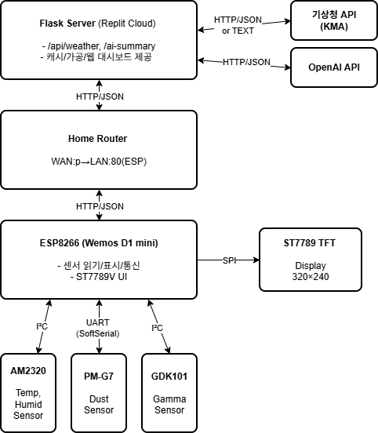
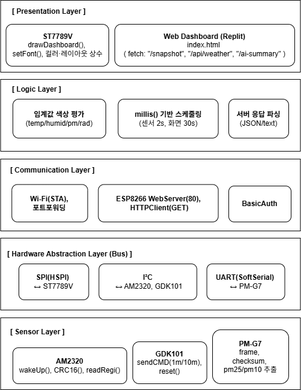

# 소프트웨어 아키텍처 문서 (SAD)

---

## 1. Introduction (소개)

### 1.1 목적

본 문서는 **ESP8266 기반 IoT 환경 센서 대시보드 시스템**의 소프트웨어 구조와 구현 방식을 정의한다.

시스템은 실내 환경 데이터를 수집·시각화하고, **Replit에 호스팅된 Flask 서버** 및 **로컬/원격 웹 대시보드**를 통해 통합 관리하는 것을 목표로 한다.

### 1.2 시스템 개요

- **센서 측정**: AM2320(온습도), PM-G7(먼지), GDK101(방사능)
- **MCU 제어 및 표시**: Wemos D1 mini(ESP8266) + ST7789V(2.0”)
- **디스플레이 인터페이스**: ESP8266 ↔ ST7789V
- **서버 연동**: Flask 서버(현재 Replit 호스팅)와 HTTP 통신
- **웹 대시보드 표시**: 실내 센서값 + 외부 날씨 + **AI 요약(application/json)** 제공
- **원격 접속**: ESP8266은 STA 모드로 공유기에 연결 후 포트포워딩으로 외부 접근 허용
- **단일 스케치 구조**: 센서 드라이버, UI, 네트워크 통신이 하나의 `.ino`에 통합됨

### 1.3 범위

- **하드웨어**: Wemos D1 mini, ST7789V, AM2320, PM-G7, GDK101
- **소프트웨어**: Arduino IDE (ESP8266 Core 3.0.2), Python Flask 3.x (Replit)
- **버스 인터페이스**: **SPI(HSPI)** for ST7789V / **I²C** for AM2320·GDK101 / **UART(SoftSerial)** for PM-G7
- **기능**: 센서 데이터 수집/시각화, Flask 연동, JSON/텍스트 송수신, AI 요약 생성
- **제외**: 장기 데이터 저장(DB), 클라우드 업로드

---

## 2. Requirements and Specifications (요구사항 및 명세)

### 2.1 기능 요구사항

| ID | 내용 | 비고 |
| --- | --- | --- |
| F1 | 온도, 습도, PM2.5, PM10, 방사능(1m/10m) 측정 | AM2320, PM-G7, GDK101 |
| F2 | 2초 주기로 센서 갱신 | `millis()` 기반 비차단 방식 |
| F3 | Flask 서버에 HTTP 요청 | `/api/weather`, `/ai-summary`, `/snapshot` |
| F4 | ST7789V 표시 | 카드형 레이아웃, 좌측 시계 |
| F5 | JSON 포맷 통신 | `{ "Temperature":24.5, ... }` |
| F6 | Wi-Fi 연결(AP/STA) | `WiFi.softAP()`, `WiFi.begin()` |
| F7 | 원격 접근 (포트포워딩) | WAN→LAN |
| F8 | 날씨 예보 | 기상청 API, JSON or text 응답 |
| F9 | AI 요약 생성(application/json) | OpenAI API, JSON 문자열 응답 |

### 2.2 비기능 요구사항

| 항목 | 설명 |
| --- | --- |
| 신뢰성 | HTTP 재시도(지수 백오프), 센서 미응답 시 이전 값 유지 |
| 확장성 | 센서 클래스 구조로 신규 추가 용이 |
| 유지보수성 | 버스(HAL) 모듈화, 상수 정의 분리 |
| 보안 | Replit Secrets로 키 관리, ESP BasicAuth |

### 2.3 제약조건

- ESP8266 메모리: ~80 KB 내 동작
- 라이브러리 사용: `Adafruit_ST7789`, `Adafruit_GFX`, `SPI.h`, `Wire.h`, `SoftwareSerial.h`

---

## 3. Block Diagram (시스템 블록 다이어그램)



---

## 4. Software Architecture



---

## 5. Software Implementation

### 5.1 소스 구성

| 파일 | 설명 |
| --- | --- |
| `esp8266_dashboard.ino` | 메인 스케치 (센서·UI·서버 포함) |
| `sensor_defs.h` | 센서 주소·CRC·명령 상수 |
| `st7789v.h` | SPI 핀·색상·좌표 상수 |
| `src/get_weather.py` | Weather Adapter (KMA API + 캐시) |
| `src/get_ai_summary.py` | AI 요약 생성 (OpenAI API) |
| `static/js/buildNow.js` | 현재 날씨 UI 렌더링 (캐시 10분) |
| `static/js/buildHours.js` | 시간별 예보 UI 렌더링 (최대 18시간) |
| `static/js/buildDays.js` | 일별 예보 UI 렌더링 (fallback 지원) |
| `static/js/getAISummary.js` | AI 요약 로드 및 표시 |

### 5.2 스케줄링

- 센서: 2 s 주기
- 화면: 30 s 주기
- 서버루프: `server.handleClient()` 지속 호출

### 5.3 센서 드라이버

| 센서 | 인터페이스 | 특징 |
| --- | --- | --- |
| AM2320 | I²C | Modbus readReg + CRC16 |
| PM-G7 | UART(SW) | 헤더·체크섬 검증 |
| GDK101 | I²C | 명령 기반, 1m/10m 평균값 |

### 5.5 UI/UX (ST7789V)

- **레이아웃**: 좌측 시계, 우측 3개 카드(Temp/Humid, Dust, Radiation)
- **임계값**
    - Temp 18–27 OK / 16–29 WARN
    - Humid 40–60 OK / 30–70 WARN
    - PM2.5 ≤15 OK / ≤35 WARN / >35 BAD
    - Radiation <0.3 OK / <0.6 WARN / ≥0.6 BAD

### 5.6 클라이언트 JavaScript 구조

**모듈 구성**

| 파일 | 역할 | 특징 |
| --- | --- | --- |
| `buildNow.js` | 현재 날씨 표시 | 10분 캐시, TMN/TMX 폴백 로직 |
| `buildHours.js` | 시간별 예보 | 최대 18시간, 현재 시각부터 표시 |
| `buildDays.js` | 일별 예보 | /api/daily |
| `getAISummary.js` | AI 요약 로드 | JSON 문자열 처리 |

---

## 6. Weather Adapter (KMA)

- 단기·중기 예보 통합 → `{ now, hourly, daily }` 구조
- 비JSON 응답 파싱 및 숫자 정규화
- 캐시: `@lru_cache(maxsize=1)` + `_last_good_weather`
- 실패 시 이전 정상값 반환(`stale:true`)

**TMN/TMX 정확도 개선**
- 기상청 단기예보 API에서 TMN/TMX는 **오전 2시(baseTime=0200)에만 발표**됨
- **해결책**: daily 데이터용 baseTime을 항상 0200 또는 2300만 사용
  - 현재 시각이 02시 이전: 전날 2300 발표본 사용
  - 02시 이후: 당일 0200 발표본 사용
- hourly 데이터는 별도의 baseTime 사용 (동적 계산)
- **프리패치 일정** (3회/일, API 호출 최적화):
  - 02:10: hourly(02~17시), daily(0200 TMN/TMX)
  - 14:10: hourly(14~익일05시), daily(0200 TMN/TMX 유지)
  - 23:10: hourly(23~익일14시), daily(2300 TMN/TMX)

---

## 7. AI Summary (텍스트 요약)

- 엔드포인트: `/ai-summary` → `application/json; charset=utf-8`
- 입력: snapshot + weather + location("서울시 마포구")
- 출력: JSON 문자열 형태의 자연어 요약 (2–6 문장)
  ```json
  "현재 실내 온도는 24.4℃로 쾌적한 상태이며..."
  ```
- 클라이언트 처리: 
  - `typeof data === "string"` → 텍스트 렌더링
  - `typeof data === "object"` → JSON 객체 렌더링 (summary + tips)
- 캐시 TTL = 5분

---

## 8. 운영 시나리오

1. 사용자가 Replit URL 접속 → index.html 로드
2. 클라이언트 JS가 `/snapshot`, `/api/weather`, `/ai-summary` 요청
3. Flask 서버가 ESP `/snapshot` 프록시(BasicAuth)
4. 데이터 병합 → 웹대시보드 표시
5. ST7789V는 SPI 로컬 렌더링, Flask 응답 지연 시에도 독립 동작

---

## 9. 보안 / 배포 / 운영

| 항목 | 설명 |
| --- | --- |
| 인증 | ESP BasicAuth(`admin/esp12f`) |
| 비밀키 | Replit Secrets 활용 |
| 배포 | Arduino IDE (74880 bps), Replit Flask Cloud |
| 모니터링 | 센서 오류·HTTP 지연·캐시 상태 로그 |

---

## 10. 향후 개선 로드맵

- [ ]  라이트/다크 테마 전환 (TFT 팔레트 토글)
- [ ]  기상청 초단기예보 API 활용
- [ ]  AI 요약 지침 템플릿 다양화

---

## 부록. 핀맵 (Wemos D1 mini 기반 전체 배선표)

| Wemos D1 mini 핀 | 연결 대상 | 기능 | 비고 |
| --- | --- | --- | --- |
| **5V** | AM2320 VCC | 전원 (5V) | 온습도 센서 전원 |
|  | GDK101 VCC | 전원 (5V) | 방사능 센서 전원 |
|  | PM-G7 VCC | 전원 (5V) | 먼지 센서 전원 |
| **3V3** | ST7789V VCC, BL | 전원 (3.3V) | 디스플레이 전원 및 백라이트 |
| **G (GND)** | USB-TTL GND | 공통 접지 |  |
|  | AM2320 GND |  |  |
|  | GDK101 GND |  |  |
|  | PM-G7 GND |  |  |
|  | ST7789V GND |  | 모든 장치 공통 GND 필요 |
| **D0 (GPIO16)** | ST7789V RST | Reset | 디스플레이 리셋 핀 |
| **D1 (GPIO5)** | AM2320 SCL, GDK101 SCL | I²C SCL | I²C 클록 |
| **D2 (GPIO4)** | AM2320 SDA, GDK101 SDA | I²C SDA | I²C 데이터 |
| **D3 (GPIO0)** | PM-G7 TX | UART RX (SoftwareSerial) | Dust 센서 데이터 입력 |
| **D4 (GPIO2)** | ST7789V DC | SPI DC / Data-Command | 부트 시 HIGH 필요 |
| **D5 (GPIO14)** | ST7789V SCK | SPI Clock | HSPI SCLK |
| **D6 (GPIO12)** | — | (미사용) | SPI MISO (ST7789V에서는 불필요) |
| **D7 (GPIO13)** | ST7789V DIN | SPI MOSI | HSPI 데이터 출력 |
| **D8 (GPIO15)** | ST7789V CS | SPI Chip-Select | 부트 시 LOW 필요 (기본 Pull-down) |
| **RST** | — | MCU Reset | 보드 리셋 시 전체 재시작 |
| **A0** | — | 아날로그 입력(미사용) |  |

| 버스 | 구성요소 | 핀 | 설명 |
| --- | --- | --- | --- |
| **SPI (HSPI)** | ST7789V | D5(SCK), D7(DIN), D8(CS), D4(DC), D0(RST) | 고속 표시용 (27–40 MHz) |
| **I²C** | AM2320, GDK101 | D1(SCL), D2(SDA) | 온습도 및 방사능 센서 |
| **UART (SWSerial)** | PM-G7 | D3(TX → RX) | 미세먼지 측정 센서 |
| **전원** | 5V / 3.3V / GND | — | ST7789은 3.3 V |
